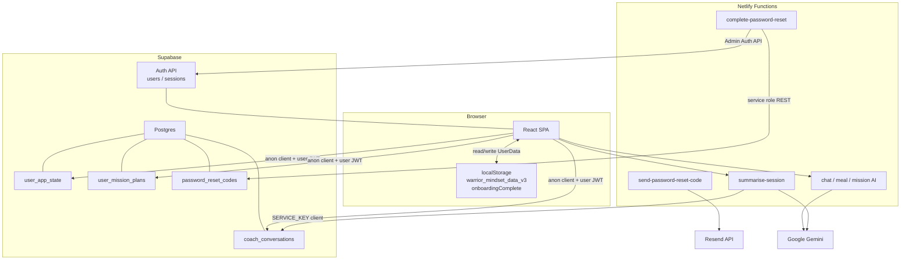
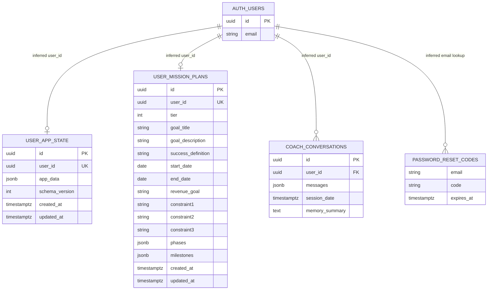
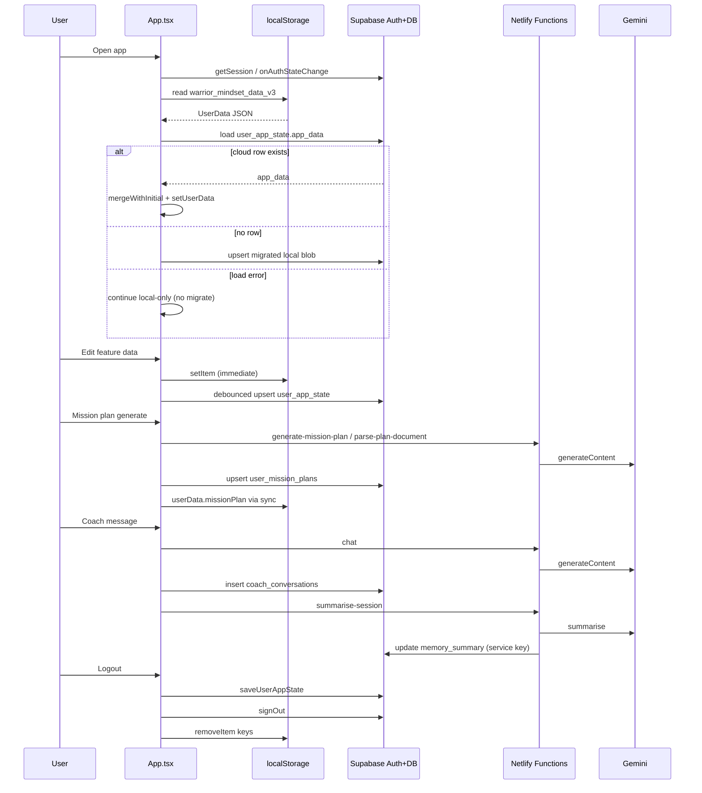

# DATABASE.md

**Status:** Permanent database and data-architecture reference for the Warrior Mindset App.  
**Companions:** `PROJECT.md` (system facts), `AI_CONTEXT.md` (engineering constitution).  
**Rule:** Prefer **code evidence** over memory. Label every claim as Verified, Strongly Inferred, or Unconfirmed.

---

## 1. Purpose and Scope

This document describes how the Warrior Mindset App stores, syncs, authenticates, and serves data across:

- Supabase Auth
- Supabase Postgres (application tables)
- Browser `localStorage`
- Netlify serverless functions
- Related external services that touch identity or messaging (Gemini for session summaries; Resend for alternate reset emails)

### Evidence classes used throughout

| Label | Meaning |
|-------|---------|
| **Verified** | Directly observable in repository source (queries, env names, interfaces, call sites). |
| **Strongly Inferred** | Required for the code to work as written (e.g. unique `user_id` implied by `onConflict: 'user_id'`), or stated in code comments without accompanying SQL. |
| **Unconfirmed** | Cannot be proven from this repository (dashboard settings, actual Postgres types, RLS, triggers, backups, who inserts reset codes, etc.). |

### Explicitly out of scope / not in-repo

- No `.sql` files, migration folders, or Supabase CLI config were found.
- No RLS policy definitions, grants, or indexes appear in source.
- Production secret values are never documented here.

---

## 2. Database Architecture Overview

### How each piece participates

| System | Role in data architecture |
|--------|---------------------------|
| **Supabase Auth** | Email/password identity; session tokens used by the browser Supabase client for table access. |
| **Supabase Postgres** | Persists `user_app_state`, `user_mission_plans`, `coach_conversations`, and (for alternate reset) `password_reset_codes`. |
| **localStorage** | Primary always-on store for the `UserData` blob and onboarding flag; survives AI/network failures. |
| **Netlify functions** | Server-side Gemini proxy; session memory write via service key; optional password-reset helpers. |
| **Google Gemini** | No durable app DB of its own; used to generate coach replies, plans, meal analysis, and conversation summaries. |
| **Resend** | Sends password-reset **codes** by email in the alternate flow; does not itself persist codes. |

### Architecture diagram (data flow)



---

## 3. Supabase Project Configuration

### Client initialization — Verified

File: `copy-of-awaken-the-warrior-mindset/services/supabase.ts`

```ts
createClient(import.meta.env.VITE_SUPABASE_URL, import.meta.env.VITE_SUPABASE_ANON_KEY)
```

Throws at import time if either variable is missing. Single shared export: `supabase`.

### Required environment variables (names only)

| Variable | Where used | Confidence |
|----------|------------|------------|
| `VITE_SUPABASE_URL` | Browser client; optional fallback in `complete-password-reset` | Verified |
| `VITE_SUPABASE_ANON_KEY` | Browser client | Verified |
| `SUPABASE_URL` | `summarise-session`; preferred URL in `complete-password-reset` | Verified |
| `SUPABASE_SERVICE_ROLE_KEY` | `complete-password-reset` | Verified |
| `SUPABASE_SERVICE_KEY` | `summarise-session` | Verified (different name) |

Documented for local setup in `.env.example`: `VITE_SUPABASE_URL`, `VITE_SUPABASE_ANON_KEY` (plus `GEMINI_API_KEY` for AI, not DB).

### Anonymous client usage — Verified

- All browser table access goes through the anon-key client.
- Auth methods attach the user session JWT automatically after login.
- **Implied requirement (Strongly Inferred / Unconfirmed deployment):** RLS must allow a user to read/write only their own rows for the client paths to be safe.

### Service-role usage — Verified

| Function | Credential env | Access pattern |
|----------|----------------|----------------|
| `summarise-session.js` | `SUPABASE_SERVICE_KEY` | `@supabase/supabase-js` `createClient` then `update` on `coach_conversations` |
| `complete-password-reset.js` | `SUPABASE_SERVICE_ROLE_KEY` | Raw REST to `/rest/v1/password_reset_codes` and `/auth/v1/admin/users` |

### Authentication lifecycle — Verified

1. `getSession()` on mount → set `currentUser` / `authReady`
2. `onAuthStateChange` keeps session in sync; `PASSWORD_RECOVERY` opens reset UI
3. Cloud hydrate/save keyed by `currentUser.id`
4. Logout: cloud save → `signOut` → clear local keys → reset in-memory sync guards

### Security boundaries — Verified / Strongly Inferred

- **Verified:** Anon key is client-exposed by design; service keys appear only in Netlify function code paths.
- **Verified:** `summarise-session` accepts `userId` / `sessionId` from the request body with **no** visible JWT verification in that function — service-role update is trusted if the function URL is reachable (**risk**).
- **Unconfirmed:** Whether Netlify function URLs are additionally locked down, and whether RLS is enabled in production.

---

## 4. Authentication Data Model

### Relationship to application tables

```
auth.users.id  ──(logical FK)──► user_app_state.user_id       (0..1)
auth.users.id  ──(logical FK)──► user_mission_plans.user_id   (0..1)
auth.users.id  ──(logical FK)──► coach_conversations.user_id  (0..N)
auth.users.email ──(lookup)──► password_reset_codes.email     (0..N, alternate flow)
```

No SQL `REFERENCES` clauses appear in-repo. Relationships are **Strongly Inferred** from query filters and upsert conflict targets.

### Flows

| Flow | Implementation | Confidence |
|------|----------------|------------|
| **Sign-up** | `supabase.auth.signUp({ email, password, options: { emailRedirectTo: origin } })` in `AuthView.tsx` | Verified |
| **Login** | `signInWithPassword` | Verified |
| **Password recovery (primary UI)** | `resetPasswordForEmail(email, { redirectTo: origin })` | Verified |
| **Password update (recovery session)** | `PASSWORD_RECOVERY` → `ResetPasswordView` → `auth.updateUser({ password })` → `signOut` | Verified |
| **Logout** | Best-effort `saveUserAppState` → `auth.signOut` → `clearLocalUserData` | Verified |
| **Alternate reset-code flow** | `send-password-reset-code` (Resend email) + `complete-password-reset` (verify code row, admin password set, delete code). **Not called from `AuthView`.** | Verified functions exist; UI wiring absent |
| **God-mode emails** | `GOD_MODE_EMAILS` in `App.tsx` forces `tier: 'Legend'` and `warriorCodePoints >= 5000` after auth — **application state only**, not Auth roles | Verified |

### Known inconsistencies — Verified

- Signup form `minLength={6}`; reset form requires ≥ 8 characters.
- Primary reset path uses Supabase email links; alternate code path uses Resend + `password_reset_codes` and is unused by current UI.
- No repository code **inserts** into `password_reset_codes` (only select + delete in `complete-password-reset`). Who creates codes is **Unconfirmed**.

---

## 5. Complete Table Inventory

No other application table names appear in TypeScript/JS source beyond the four below (plus Auth Admin users API).

---

### 5.1 `user_app_state`

| Aspect | Detail | Confidence |
|--------|--------|------------|
| **Purpose** | One cloud row per user holding the full `UserData` JSON blob | Verified |
| **Primary key** | `id` (string/uuid in `UserAppStateRow`) | Strongly Inferred (interface; not selected in queries) |
| **Unique** | `user_id` — required for `onConflict: 'user_id'` | Strongly Inferred |
| **Foreign key** | Logical to `auth.users.id` | Strongly Inferred; Unconfirmed in SQL |
| **Timestamps** | `created_at`, `updated_at` on interface; comment claims DB trigger refreshes `updated_at` | Interface Verified; trigger Strongly Inferred from comment only |

#### Inferred columns

| Column | Inferred type | Required on write | Evidence |
|--------|---------------|-------------------|----------|
| `id` | string (uuid) | No (not sent on upsert) | `UserAppStateRow` |
| `user_id` | string (uuid) | Yes | upsert + `.eq('user_id')` |
| `app_data` | JSON / jsonb (`UserData`) | Yes on save | select/upsert |
| `schema_version` | number (client constant `1`) | Yes on save | upsert |
| `created_at` | timestamptz string | No | interface only |
| `updated_at` | timestamptz string | No on client upsert (comment: trigger) | interface + comment |

#### Operations

| Op | Detail | Files |
|----|--------|-------|
| **Read** | `.select('app_data').eq('user_id', userId).maybeSingle()` | `userAppStateService.ts`, also via `coachContextService.ts` → `loadUserAppState` |
| **Write** | `.upsert({ user_id, app_data, schema_version }, { onConflict: 'user_id' })` | `userAppStateService.ts`; callers `App.tsx` (debounce + logout), `migrateLocalStorageToCloud` |
| **Delete** | None in client code. Logout comment: cloud row is **never** deleted | Verified |

**Confidence overall:** Strongly Inferred schema; Verified access patterns.

---

### 5.2 `user_mission_plans`

| Aspect | Detail | Confidence |
|--------|--------|------------|
| **Purpose** | Structured mission/plan document separate from (but also mirrored in) `UserData.missionPlan` | Verified |
| **Primary key** | `id` returned on load | Strongly Inferred |
| **Unique** | `user_id` via `onConflict: 'user_id'` | Strongly Inferred |
| **Foreign key** | Logical to `auth.users.id` | Strongly Inferred |

#### Inferred columns (from upsert payload + load mapping)

| Column | Inferred type | Notes | Confidence |
|--------|---------------|-------|------------|
| `id` | string | Read on load; not set in upsert payload | Strongly Inferred |
| `user_id` | string | Conflict target | Verified usage |
| `tier` | number (`plan.tier` is `1 \| 2`) | Written | Verified |
| `goal_title` | string | | Verified |
| `goal_description` | string | | Verified |
| `success_definition` | string | | Verified |
| `start_date` | string (date) | | Verified |
| `end_date` | string (date) | | Verified |
| `revenue_goal` | string \| nullish | optional in TS | Verified |
| `constraint1` | string \| nullish | | Verified |
| `constraint2` | string \| nullish | | Verified |
| `constraint3` | string \| nullish | | Verified |
| `phases` | JSON array | | Verified |
| `milestones` | JSON array | | Verified |
| `created_at` | timestamptz string | read only in mapper | Strongly Inferred |
| `updated_at` | timestamptz string | **client sets** ISO string on upsert | Verified |

#### Operations

| Op | Detail | Files |
|----|--------|-------|
| **Read** | `.select('*').eq('user_id', userId).maybeSingle()` | `missionPlanService.ts`; `coachContextService.ts` |
| **Write** | upsert with `onConflict: 'user_id'` | `missionPlanService.ts`; `MissionControl.tsx` |
| **Delete** | **No table delete.** UI “Reset plan” sets `missionPlan: undefined` in React/`UserData` only — cloud row can remain | Verified gap |

**Confidence overall:** Strongly Inferred.

---

### 5.3 `coach_conversations`

| Aspect | Detail | Confidence |
|--------|--------|------------|
| **Purpose** | Persist coaching chat sessions and optional `memory_summary` | Verified |
| **Primary key** | `id` selected after insert | Strongly Inferred |
| **Foreign key** | `user_id` → auth user | Strongly Inferred |
| **Cardinality** | Many rows per user | Verified (insert each session; limit 5 on recent load) |

#### Inferred columns

| Column | Inferred type | Notes | Confidence |
|--------|---------------|-------|------------|
| `id` | string | Returned from insert `.select('id').single()` | Verified usage |
| `user_id` | string | Inserted | Verified |
| `messages` | JSON array `{ role, text }[]` | Inserted / selected | Verified |
| `session_date` | timestamptz string | Client sets `new Date().toISOString()`; used for `order` | Verified |
| `memory_summary` | text \| null | Selected with `.not('memory_summary', 'is', null)`; updated by function | Verified |

#### Operations

| Op | Detail | Files |
|----|--------|-------|
| **Insert** | `{ user_id, messages, session_date }` when `messages.length > 1` | `coachConversationService.ts` ← `CoachMarcus.tsx` |
| **Read messages** | last 5 by `session_date` desc | `loadRecentConversations` — **defined but no view caller found** |
| **Read summary** | latest non-null `memory_summary` | `loadMemorySummary` ← `CoachMarcus.tsx` |
| **Update** | `{ memory_summary }` by `id` | `summarise-session.js` (service key) |
| **Delete** | None in repo | Verified |

**Confidence overall:** Strongly Inferred.

---

### 5.4 `password_reset_codes`

| Aspect | Detail | Confidence |
|--------|--------|------------|
| **Purpose** | Store short-lived codes for alternate password reset | Verified by read/delete usage |
| **Primary key** | Unconfirmed | Unconfirmed |
| **Access** | Only via service-role REST in `complete-password-reset.js` | Verified |

#### Inferred columns

| Column | Inferred type | Evidence | Confidence |
|--------|---------------|----------|------------|
| `email` | string | filter `email=eq...` | Verified |
| `code` | string | filter `code=eq...` | Verified |
| `expires_at` | timestamptz parseable by `Date` | selected + expiry check | Verified |

No other columns are referenced.

#### Operations

| Op | Detail | Confidence |
|----|--------|------------|
| **Read** | GET filtered by email+code, select `email,code,expires_at` | Verified |
| **Delete** | DELETE filtered by email+code after successful password change | Verified |
| **Insert / Update** | **Not present in this repository** | Unconfirmed who writes rows |

**Files:**  
`copy-of-awaken-the-warrior-mindset/netlify/functions/complete-password-reset.js`  
`netlify/functions/complete-password-reset.js` (duplicate at repo root)

---

## 6. Entity Relationship Diagram

Relationships marked **inferred** — no SQL FK definitions in-repo.



`AUTH_USERS` = Supabase Auth users (Admin API / Auth schema). Exact schema **Unconfirmed** beyond id/email usage.

---

## 7. Detailed Data Flow

### Step-by-step (authenticated user)

1. **Initial app load** — Mount `App`; `supabase` client must already have env vars.
2. **Session detection** — `getSession` + `onAuthStateChange`; gate UI on `authReady` / `currentUser`.
3. **Local state hydration** — Read `warrior_mindset_data_v3`; merge with `INITIAL_USER_DATA` (deep-merge health/financial/community/workflows).
4. **Cloud state hydration** — Once per `user.id`: `loadUserAppState`. On success with data → replace/merge into React state; enable cloud saves. On load **error** → stay local-only; **do not** migrate. On **null** → migrate.
5. **First-time local→cloud migration** — If no cloud row, upload local blob via `saveUserAppState`.
6. **Debounced cloud saving** — Every `userData` change writes localStorage immediately; after hydrate, debounce 1000ms then upsert cloud (skip identical snapshots / hydration write).
7. **Mission-plan persistence** — On generate/update: `saveMissionPlan` **and** `update({ missionPlan })` (dual write). Coach may reload table via `loadMissionPlan`.
8. **Coach-conversation persistence** — After each exchange with >1 messages: `insert` row; then fire `summarise-session` with returned `id`.
9. **Session summarisation** — Function calls Gemini, then `update memory_summary` with service key.
10. **Logout** — Save cloud → cancel debounce timer → `signOut` → remove local keys → reset `UserData` + sync refs. Cloud rows retained.

### Sequence diagram



---

## 8. Local Storage Model

### Keys found

Search covered `localStorage` / `sessionStorage` under the app. **`sessionStorage` is unused.** Cache API in `sw.js` is separate from localStorage.

| Key | Purpose | Data shape | Read | Write | Clear | Cloud equivalent |
|-----|---------|------------|------|-------|-------|------------------|
| `warrior_mindset_data_v3` | Primary app state blob | JSON `UserData` | `App.tsx` mount; `migrateLocalStorageToCloud` | `App.tsx` `useEffect` on every `userData` change | `clearLocalUserData` on logout | `user_app_state.app_data` |
| `onboardingComplete` | Whether onboarding was dismissed | string `"true"` when set | `App.tsx` initial `showOnboarding` | `handleOnboardingClose` | `clearLocalUserData` on logout | **None** |

### Not a localStorage key (clarification)

| Name | Actual storage | Notes |
|------|----------------|-------|
| `lastAffirmationSeen` | Field inside `UserData` (`types.ts`) | Compared to today’s date in `App.tsx` after parsing the blob; synced to cloud with `app_data`. **Not** `localStorage.getItem('lastAffirmationSeen')`. |

### Other browser persistence

| Mechanism | Detail |
|-----------|--------|
| Supabase Auth session | Managed by `@supabase/supabase-js` (typically localStorage under Supabase’s own keys) — **exact key names Unconfirmed** (library default). |
| Service worker cache | `warrior-mindset-v1` cache name in `public/sw.js` — HTTP cache, not domain data. |

---

## 9. UserData Schema

**Source of truth for shape:** `copy-of-awaken-the-warrior-mindset/types.ts` (`UserData` and nested interfaces).  
**Defaults:** `copy-of-awaken-the-warrior-mindset/constants.tsx` (`INITIAL_USER_DATA`).

### Major nested sections and writers

| Section | Feature writers (primary) | Syncs inside `user_app_state.app_data`? |
|---------|---------------------------|----------------------------------------|
| `tier`, `warriorCodePoints` | Many views + god-mode + affirmation XP | Yes |
| `lifeWheel`, `vision*` | `VisionNavigator` / Foundation | Yes |
| `goals` | `GoalMaster` | Yes |
| `habits` | `HabitLaboratory` | Yes |
| `challenges` | `ChallengeNavigator` | Yes |
| `journals`, `failures` | `ResilienceView` | Yes |
| `dailyWorkflows`, journal streak fields | `JournalView` | Yes |
| `health` | `AgelessLiving` | Yes |
| `financialData`, `financialPillars`, `debtLogic` | `MasteryView` (pillars mostly initial) | Yes |
| `relationships` | `TribeView` | Yes |
| `warriorCode` | `LegacyView` | Yes |
| `communityPosts` | `CommunityView` (+ seed mocks) | Yes |
| `missionPlan` | `MissionControl` | Yes (**also** duplicated in `user_mission_plans`) |
| `lastAffirmationSeen`, `name` | `App` / optional profile fields | Yes |
| `lastFoundationSave`, journal timestamps | Foundation / Journal | Yes |

### Duplication with dedicated tables

| Domain | In blob | Dedicated table |
|--------|---------|-----------------|
| Mission plan | `UserData.missionPlan` | `user_mission_plans` |
| Coach chat | Not stored in blob (in-memory UI) | `coach_conversations` |
| Coach memory | Injected at runtime from table | `coach_conversations.memory_summary` |

### Risks of one JSON blob — code-evident

- Large growth (especially community images as data URLs).
- Partial-field merges required on hydrate (`health`, `financialData`) — easy to drop nested keys if merge logic is incomplete.
- `schema_version` written as `1` with **no** versioned migration functions beyond merge-with-initial.
- Debounced cloud write can lag local meal logs (coach context deliberately prefers local `mealLogs`).
- Entire document rewritten on each upsert — concurrent device conflict resolution is last-write-wins (**Strongly Inferred** behaviour).

---

## 10. Row-Level Security and Permissions

### Repository search result — Verified

- **Zero** SQL migrations, `CREATE POLICY`, RLS enablement scripts, or policy name strings were found in the repository.
- Therefore: **no RLS definitions can be claimed as deployed from this codebase.**

### Required recommendation — not verified as currently deployed

For the **anon-key browser client** to be safe in production, the following are the policies the application *appears to need*. These are **recommendations only**.

| Table | Recommended policy intent |
|-------|---------------------------|
| `user_app_state` | `SELECT/INSERT/UPDATE` only where `auth.uid() = user_id`; no cross-user read |
| `user_mission_plans` | Same as above |
| `coach_conversations` | `SELECT/INSERT` where `auth.uid() = user_id`; `UPDATE` of `memory_summary` either via service role only **or** similarly restricted |
| `password_reset_codes` | **No** anon access; service role / server only |

Additional recommendations (still unverified):

- Enable RLS on all public tables.
- Restrict `summarise-session` so arbitrary clients cannot update any `sessionId` (verify JWT or use user-scoped update).
- Confirm Auth email templates and redirect allow-lists in the dashboard.

---

## 11. Functions and Server-Side Data Access

Only functions that **read/write Supabase** (or Auth Admin) are detailed here. Pure Gemini proxies (`chat`, `analyze-meal-image`, `generate-mission-plan`, `parse-plan-document`) do **not** touch the database.

### 11.1 `summarise-session`

| Field | Value |
|-------|-------|
| **Paths** | `copy-of-awaken-the-warrior-mindset/netlify/functions/summarise-session.js` (app tree; called by SPA) |
| **Purpose** | Summarise coach transcript with Gemini; store `memory_summary` |
| **Tables** | `coach_conversations` (`update`) |
| **Auth method** | None visible — trusts POST body (`userId`, `messages`, `sessionId`) |
| **Env** | `GEMINI_API_KEY`, `SUPABASE_URL`, `SUPABASE_SERVICE_KEY` |
| **Key type** | Service-style (`SUPABASE_SERVICE_KEY`) |
| **Security risks** | Service key can bypass RLS; no proof of caller identity; IDOR if `sessionId` guessable |
| **Error behavior** | Minimal; missing fields → 400; otherwise assumes success path |

### 11.2 `complete-password-reset`

| Field | Value |
|-------|-------|
| **Paths** | App + root `netlify/functions/complete-password-reset.js` |
| **Purpose** | Verify reset code; set password via Admin API; delete code |
| **Tables / APIs** | `password_reset_codes` (GET, DELETE); Auth Admin users list + password PUT |
| **Auth method** | Service role headers on REST |
| **Env** | `SUPABASE_URL` or `VITE_SUPABASE_URL`; `SUPABASE_SERVICE_ROLE_KEY` |
| **Key type** | Service role |
| **Security risks** | Full admin capability if function exposed; enumerates users by page; no rate-limit in code |
| **Error behavior** | JSON errors for invalid/expired code, missing user, config gaps |

### 11.3 `send-password-reset-code`

| Field | Value |
|-------|-------|
| **Paths** | App + root copies |
| **Purpose** | Email a caller-supplied `code` via Resend |
| **Tables** | **None** (does not insert `password_reset_codes`) |
| **Env** | `RESEND_API_KEY`, optional `RESET_EMAIL_FROM` |
| **Security risks** | Anyone who can invoke it may trigger emails if exposed; code authenticity depends on an **Unconfirmed** inserter elsewhere |

### 11.4 Browser client (not a Netlify function)

Uses anon key + user JWT for `user_app_state`, `user_mission_plans`, `coach_conversations` as documented in §5.

---

## 12. Environment Variable Matrix

| Variable | Consumer | Purpose | Secret? |
|----------|----------|---------|---------|
| `VITE_SUPABASE_URL` | Vite client; optional fallback in complete-reset | Project URL | No (public URL) |
| `VITE_SUPABASE_ANON_KEY` | Vite client | Anon API key | Public by design; protect via RLS |
| `SUPABASE_URL` | summarise-session; complete-reset preferred | Project URL server-side | No |
| `SUPABASE_SERVICE_ROLE_KEY` | complete-password-reset | Admin / bypass RLS | **Yes** |
| `SUPABASE_SERVICE_KEY` | summarise-session | Intended service credential | **Yes** |
| `RESEND_API_KEY` | send-password-reset-code | Email send | **Yes** |
| `RESET_EMAIL_FROM` | send-password-reset-code | From address (default `onboarding@resend.dev`) | Low sensitivity |
| `GEMINI_API_KEY` | AI functions (+ Vite define) | Model access | **Yes** (not a DB secret but adjacent) |

### Naming inconsistency — Verified

`SUPABASE_SERVICE_ROLE_KEY` vs `SUPABASE_SERVICE_KEY` are **different env names** in different functions.

**Likely operational impact:** Configuring only one of them causes one server path to work and the other to fail (summaries fail soft / throw; password-complete returns 500 “credentials not configured”). Operators may believe “service role is set” while `summarise-session` still sees `undefined`.

---

## 13. Schema Gaps and Unverified Infrastructure

Cannot be confirmed from this repository:

- SQL migrations / migration history
- Exact Postgres column types, defaults, nullability constraints
- Whether RLS is enabled or which policies exist
- Existence of the `updated_at` trigger claimed in comments
- Indexes, check constraints, foreign keys
- Supabase Storage buckets (no `storage.from` usage found)
- Realtime publications
- Dashboard Auth settings (email confirm, redirect allow-list, SMTP)
- Production secrets and rotation
- Backup / PITR policies
- Who **inserts** `password_reset_codes`
- Whether root vs app Netlify function trees both deploy
- Exact Auth session storage key names used by supabase-js

---

## 14. Known Database Risks

All items below are **code-evident** or **strongly implied** by the architecture:

1. **Full app state as one JSON blob** — size, merge, and conflict risks.
2. **Dual local/cloud persistence** — temporary divergence; complex hydrate guards.
3. **Potential overwrite races** — multi-device last-write-wins; debounce windows.
4. **No visible migrations** — schema drift between environments is easy.
5. **Duplicate mission data** — blob vs `user_mission_plans`; reset clears blob field only.
6. **Service-role env name split** — `SERVICE_KEY` vs `SERVICE_ROLE_KEY`.
7. **Password-reset split** — primary Auth email flow vs unused code-table flow; missing insert path in-repo.
8. **Hardcoded privileged emails** — god-mode mutates persisted tier/XP in user data.
9. **Community images in JSON** — data URLs inflate `app_data`.
10. **`schema_version` without migration framework** — always written as `1`.
11. **`summarise-session` IDOR risk** — service update by `sessionId` without visible authz.
12. **Stale service comment** — `userAppStateService` still says not wired into `App.tsx` though it is.
13. **Unused `loadRecentConversations`** — dead read path may confuse future schema work.

---

## 15. Recommended Database Improvements

*Not implemented. Recommendations only.*

### Critical
- Confirm and document production RLS for all four tables; deny anon access to `password_reset_codes`.
- Unify service-role env var naming across Netlify functions.
- Add authentication/authorization to `summarise-session` (verify user owns `sessionId`).

### High priority
- Add in-repo SQL migrations (or Supabase migration folder) matching inferred schema.
- Fix mission “Reset plan” to also clear/update `user_mission_plans` (or document intentional orphan rows).
- Either wire the reset-code flow end-to-end (including **insert**) or remove dead functions to reduce attack surface.
- Introduce real `schema_version` upgrade functions when `UserData` shape breaks.

### Medium priority
- Move community images / large binaries out of JSON (Storage) if social features expand.
- Conflict strategy for multi-device sync (version vectors or `updated_at` compare).
- Use `loadRecentConversations` or delete it to avoid false expectations.
- Stop embedding god-mode entitlements only in client-mutated JSON; prefer server claims if privilege remains.

### Future scalability
- Normalize high-churn domains (journal, health logs, posts) out of the monolith blob.
- Genuine multi-user community tables.
- Billing entitlements table instead of client-writable `tier`.
- Read replicas / archival for coach_conversations growth.

---

## 16. Migration and Change-Control Rules

1. **Never change production schema without a migration** checked into the repository (or an approved external migration system linked from this file).
2. **Never delete columns or tables without explicit human approval.**
3. **Back up** (dashboard backup / dump) before destructive changes.
4. **Preserve backward compatibility** for existing `app_data` blobs; additive fields with defaults preferred.
5. **Document rollback steps** in the PR and in `CHANGELOG.md` when present.
6. **Update `DATABASE.md` and `CHANGELOG.md`** in the same change set when schema or data contracts change; update `PROJECT.md` diagrams if architecture shifts.
7. **Validate RLS** in a non-production project before production deploy.
8. **Avoid exposing service-role credentials** to the client, logs, or docs.
9. **Test with a non-production Supabase project first.**
10. Prefer expandable JSON keys carefully — every new persisted field needs merge/default handling in hydrate paths.

---

## 17. Database Definition of Done

A database-related feature is complete only when:

- [ ] All new/changed queries are listed and match intended tables/columns
- [ ] Inferred schema updates are reflected in **§5** of this file
- [ ] Backward compatibility for existing rows/`app_data` is designed and tested
- [ ] RLS impact is reviewed (recommendation updated; production confirmation noted if known)
- [ ] Env vars documented in §12 and `.env.example` (names only)
- [ ] No service-role key added to client bundles
- [ ] Error paths fail soft in the SPA or return structured errors from functions
- [ ] Dual-write domains (mission plan) stay consistent or intentional divergence is documented
- [ ] `PROJECT.md` / `CHANGELOG.md` updated when contracts change
- [ ] Open questions in §19 updated if new unknowns appear

---

## 18. Source File Index

| File | Database knowledge contributed |
|------|--------------------------------|
| `services/supabase.ts` | Client init; required Vite env vars |
| `services/userAppStateService.ts` | `user_app_state` CRUD/migrate/clear; `UserAppStateRow`; trigger comment; schema_version |
| `services/missionPlanService.ts` | `user_mission_plans` upsert/load column map |
| `services/coachConversationService.ts` | `coach_conversations` insert/select patterns |
| `services/coachContextService.ts` | Cloud reload of app state + mission plan for AI |
| `App.tsx` | Auth lifecycle; local+cloud sync; god-mode; logout save; localStorage keys |
| `views/AuthView.tsx` | signUp / signIn / resetPasswordForEmail |
| `views/ResetPasswordView.tsx` | updateUser password |
| `views/CoachMarcus.tsx` | saveConversation + summarise-session call |
| `views/MissionControl.tsx` | Dual write mission plan; reset clears blob only |
| `types.ts` | `UserData` / `MissionPlan` domain model |
| `constants.tsx` | `INITIAL_USER_DATA` defaults seeded into blob |
| `.env.example` | Documented client env names |
| `netlify/functions/summarise-session.js` | Service-key update of `memory_summary` |
| `netlify/functions/complete-password-reset.js` | `password_reset_codes` + Auth Admin |
| `netlify/functions/send-password-reset-code.js` | Resend-only; no DB write |
| Root `netlify/functions/*` | Duplicate reset/chat helpers |
| `public/sw.js` | Cache API only (not Postgres) |
| `package.json` | `@supabase/supabase-js` dependency |

Feature views that mutate `UserData` (Foundation cluster, Journal, Ageless, Wealth, Resilience, Tribe, Community, Legacy, Subscription) indirectly drive `user_app_state` via `App.tsx` persistence.

---

## 19. Open Questions

Require Supabase dashboard / production / ops access to answer:

1. Are RLS policies enabled on `user_app_state`, `user_mission_plans`, `coach_conversations`, and `password_reset_codes`?
2. What are the exact Postgres types, defaults, and constraints for each column?
3. Does an `updated_at` trigger exist on `user_app_state` as the comment claims?
4. What process **inserts** rows into `password_reset_codes`?
5. Is email confirmation required before login in production Auth settings?
6. Which Netlify base directory / functions folder is actually deployed?
7. Are `SUPABASE_SERVICE_KEY` and `SUPABASE_SERVICE_ROLE_KEY` both set, and to the same secret?
8. Are there Storage buckets, Edge Functions, or additional tables not referenced by this SPA?
9. What backup / point-in-time recovery posture exists?
10. After mission “Reset plan”, should orphaned `user_mission_plans` rows be deleted or retained by product policy?

---

## Document control

| Item | Value |
|------|-------|
| Role | Permanent database & data-architecture reference |
| Create rule | Only document repository-supported facts; label inference |
| Update rule | Same PR/series as schema or persistence behaviour changes |
| Related | `PROJECT.md`, `AI_CONTEXT.md`, future `CHANGELOG.md` / migrations |

**End of DATABASE.md**
