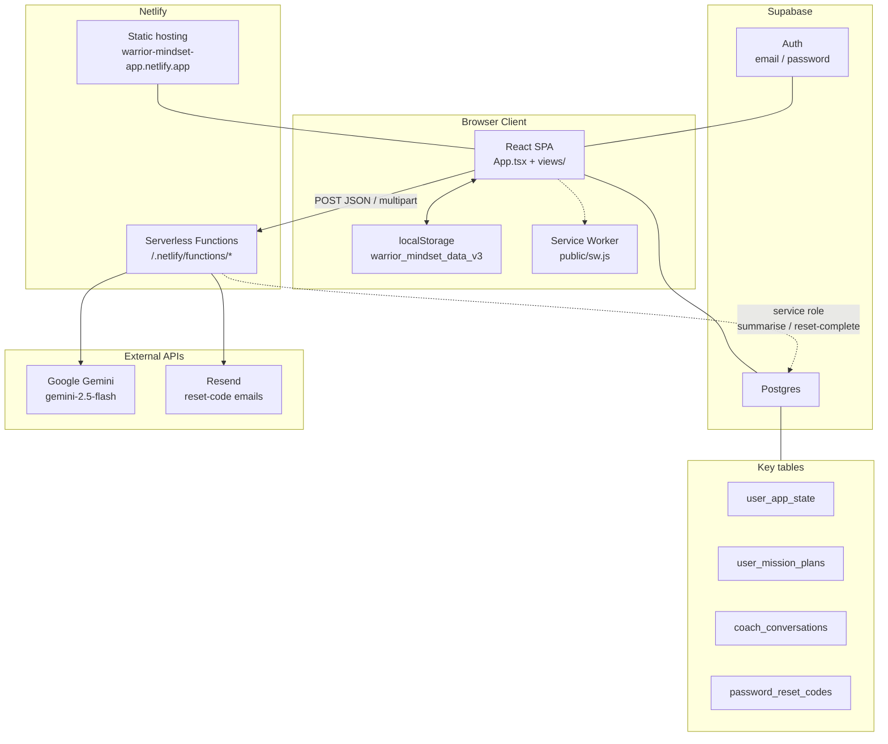
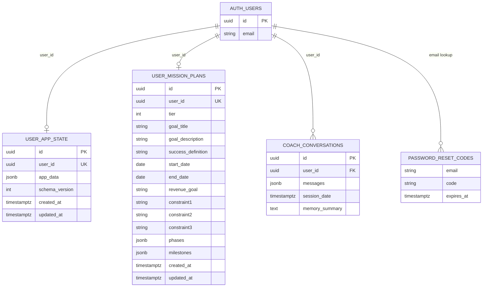
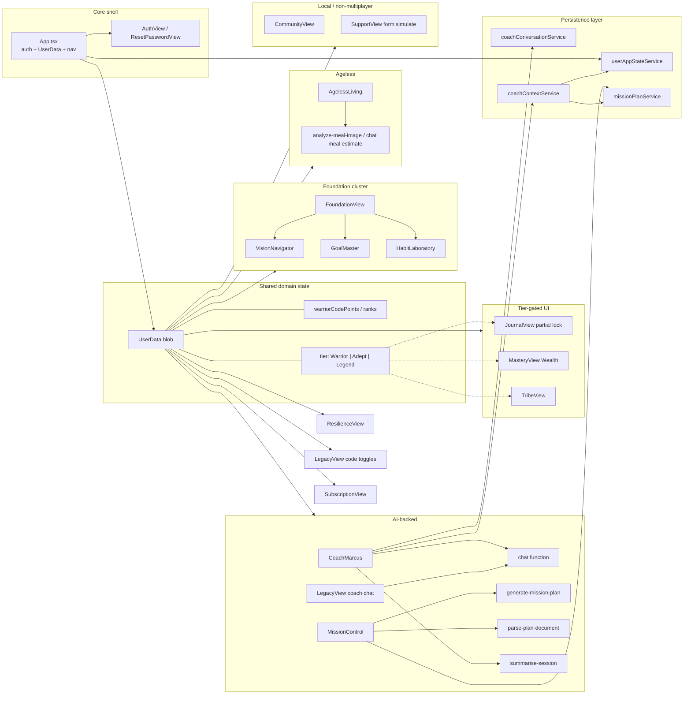

# Warrior Mindset App — Project Knowledge Base

> Generated from the repository source as of analysis. Contains only facts verifiable from the codebase. Do not treat this as marketing copy or product roadmap beyond what the code shows.

**Canonical app path:** `copy-of-awaken-the-warrior-mindset/`  
**Repo root:** `/Users/macminim2/warrior-mindset-app`  
**Live URL (from `index.html` Open Graph tags):** `https://warrior-mindset-app.netlify.app`

---

## 1. Executive Summary

This is a React + Vite single-page application branded **“Awaken the Warrior Mindset”** (PWA short name: “Warrior Mindset”). It is a personal-development / life-operating-system app based on the book and coaching philosophy of Dato' Marcus R. Mehta. Users authenticate with Supabase Auth, keep a large local `UserData` blob in `localStorage`, and sync that blob to Supabase (`user_app_state`). AI features (Coach Marcus, meal analysis, Mission Control plan generation) call Netlify serverless functions that proxy Google Gemini (`gemini-2.5-flash`). There is no client-side payment processor wired; subscription/rank UI is informational and tier gates are mostly client-side.

---

## 2. Business Purpose

Verified from `metadata.json`, `SupportView` Terms copy, `constants.tsx` (`COACH_SYSTEM_PROMPT`), and UI labels:

- SaaS-style personal development platform for clarity, discipline, habits, health, wealth tracking, resilience, and community-style sharing.
- Centered on an AI accountability partner branded **Coach Marcus AI**, modeled on Dato Marcus R. Mehta.
- Educational / self-improvement tool; Terms text states it does **not** constitute medical, psychological, or financial advice.
- Support contact referenced in UI: `support@warriormindset.my`.
- Currency display in coach context / wealth logic uses **RM** (Malaysian Ringgit) formatting.

---

## 3. Overall Architecture

```
┌─────────────────────────────────────────────────────────────┐
│  Browser (React SPA + optional PWA service worker)          │
│  App.tsx owns UserData + ViewType navigation                │
│  Persistence: localStorage key warrior_mindset_data_v3      │
└───────────────┬───────────────────────────┬─────────────────┘
                │                           │
                ▼                           ▼
     Supabase JS Client              Netlify Functions
     - Auth                         /.netlify/functions/*
     - user_app_state               - chat
     - user_mission_plans           - analyze-meal-image
     - coach_conversations          - generate-mission-plan
     - password_reset_codes         - parse-plan-document
       (server-side only)           - summarise-session
                                    - send/complete-password-reset
                                            │
                                            ▼
                                     Google Gemini API
                                     Resend (reset emails)
```

**Important layout quirk:** Application source and most Netlify functions live under `copy-of-awaken-the-warrior-mindset/`. Repo-root `netlify.toml` sets `directory = "netlify/functions"`, which points at the **root** `netlify/functions/` folder (subset of functions). The fuller function set is under `copy-of-awaken-the-warrior-mindset/netlify/functions/`. Production behavior depends on how Netlify’s base/publish directories are configured in the Netlify UI (not fully declared in the checked-in `netlify.toml`).

---

## 4. Technology Stack

| Layer | Technology |
|--------|------------|
| UI | React 19 (`react`, `react-dom`) |
| Language | TypeScript (~5.8) |
| Bundler / dev server | Vite 6 (`@vitejs/plugin-react`), port **3000**, host `0.0.0.0` |
| Styling | Tailwind via CDN (`cdn.tailwindcss.com`) + CSS variables in `index.html` |
| Fonts | Google Fonts: Anton, Inter, Playfair Display |
| Icons | `lucide-react` |
| Charts | `recharts` |
| Markdown (coach replies) | `react-markdown` |
| Auth / DB client | `@supabase/supabase-js` |
| AI (server) | Google Generative Language API `gemini-2.5-flash`; `@google/genai` / `@google/generative-ai` also listed in `package.json` (client packages present; chat path uses serverless `fetch`) |
| Hosting | Netlify (site id in `.netlify/state.json`; OG URL confirms Netlify) |
| PWA | `public/manifest.json` + `public/sw.js` registered from `index.html` |

There is **no** React Router: navigation is in-memory `ViewType` state in `App.tsx`.

---

## 5. Folder Structure

```
warrior-mindset-app/                          # git repo root
├── PROJECT.md                                # this document
├── netlify.toml                              # functions directory = netlify/functions
├── package-lock.json                         # empty packages {} lock named warrior-mindset-app
├── .gitignore                                # ignores .netlify
├── .netlify/state.json                       # Netlify site id
├── netlify/functions/                        # subset: chat, password reset helpers
│   ├── chat.js
│   ├── send-password-reset-code.js
│   └── complete-password-reset.js
└── copy-of-awaken-the-warrior-mindset/       # THE APPLICATION
    ├── App.tsx                               # shell, auth gate, cloud sync, nav
    ├── index.tsx / index.html
    ├── constants.tsx                         # INITIAL_USER_DATA, ranks, coach prompt
    ├── types.ts                              # domain types
    ├── package.json / vite.config.ts / tsconfig.json
    ├── metadata.json                         # AI Studio app metadata
    ├── logo.png
    ├── .env.example
    ├── public/                               # manifest, sw.js, icons, og-image
    ├── services/
    │   ├── supabase.ts
    │   ├── userAppStateService.ts
    │   ├── missionPlanService.ts
    │   ├── coachConversationService.ts
    │   ├── coachContextService.ts
    │   └── gemini.ts                         # client wrappers → Netlify functions
    ├── views/                                # feature screens (see §6 / §14)
    └── netlify/functions/                    # full function set used by app fetches
        ├── chat.js
        ├── analyze-meal-image.js
        ├── generate-mission-plan.js
        ├── parse-plan-document.js
        ├── summarise-session.js
        ├── send-password-reset-code.js
        └── complete-password-reset.js
```

---

## 6. Application Features

| Area | Implementation |
|------|----------------|
| **Foundation** | Life-circle scores, 1/3/5-year vision (`VisionNavigator`), goals + milestones (`GoalMaster`), habits (`HabitLaboratory`) |
| **Mission Control** | AI Q&A plan builder, PDF upload parse, milestone dashboard; persists to `user_mission_plans` + `userData.missionPlan` |
| **Journal** | Daily workflow (morning intention, priorities, afternoon, evening reflection, shutdown checklist); streak tracking |
| **Ageless Living** | Tabs: Movement, Nutrition, Fasting, Sleep, Settings — workouts, meal photo/text AI macros, water, fasting timer, sleep scores, supplements/meds, body stats |
| **Wealth (`MasteryView`)** | Income/expense/asset/liability tables + charts; gated by `tier === 'Adept' \|\| 'Legend'` |
| **Resilience** | Cognitive reframe journal + After Action Reports (`failures`) + 5-stage challenges (`ChallengeNavigator`) |
| **Tribe** | Relationship map (Inner Circle / Tribe / Extended); gated by `tier === 'Legend'` |
| **Community** | Local feed posts/reactions + mock seed posts + local leaderboard; **not** a multi-user backend |
| **Legacy** | Warrior Code principles toggle + Socratic Coach Marcus alignment chat |
| **Coach Marcus** | Chat UI, voice input (Web Speech API), cloud context merge, conversation persistence + session summary |
| **Subscription / Rank** | XP (`warriorCodePoints`) → ranks; informational tier cards (no Stripe/checkout code) |
| **Support / Codex** | FAQ, simulated contact form, Privacy/ToS modals, operating-system explainer |
| **Onboarding** | Multi-slide modal; flag `onboardingComplete` in localStorage |
| **Daily affirmation** | Modal on first load of day (`lastAffirmationSeen`); awards +15 points on dismiss |
| **Mobile wrapper mode** | Detected via UA `WarriorMobileWrapper` or `?platform=mobile`; hides some unlock CTAs |

---

## 7. User Journey

1. App loads → wait for Supabase `getSession` (`authReady`).
2. If no session → `AuthView` (login / signup / forgot password via Supabase email).
3. If `PASSWORD_RECOVERY` auth event → `ResetPasswordView`.
4. Authenticated → hydrate `UserData` from `localStorage`, then cloud load/migrate (`user_app_state`).
5. Optional onboarding modal if `onboardingComplete` missing.
6. Optional daily affirmation modal if `lastAffirmationSeen` ≠ today.
7. Default view: **Foundation**; bottom nav switches modules; side menu reaches Coach, Support, Codex, Rank, logout.
8. Edits update React state → always write `localStorage`; after cloud hydrate, debounce-save to Supabase (1s).
9. Logout → best-effort cloud save → `signOut` → clear local keys → reset in-memory state.

---

## 8. Authentication Flow

**Primary path (wired in UI):**

| Action | API |
|--------|-----|
| Sign up | `supabase.auth.signUp({ email, password, options: { emailRedirectTo: origin } })` |
| Log in | `supabase.auth.signInWithPassword` |
| Forgot password | `supabase.auth.resetPasswordForEmail(email, { redirectTo: origin })` |
| Recovery UI | `onAuthStateChange` event `PASSWORD_RECOVERY` → `ResetPasswordView` → `supabase.auth.updateUser({ password })` then `signOut` |
| Log out | `supabase.auth.signOut` after cloud save |

**Password length inconsistency:** signup form `minLength={6}`; reset form requires **≥ 8** characters.

**Alternate / unused from UI (server functions exist):**

- `send-password-reset-code` — emails a code via Resend.
- `complete-password-reset` — verifies row in `password_reset_codes`, updates password with Supabase Admin API, deletes code.

`AuthView` does **not** call those Netlify functions; it uses Supabase’s built-in email reset.

**God mode:** emails listed in `GOD_MODE_EMAILS` in `App.tsx` force `tier: 'Legend'` and at least 5000 `warriorCodePoints`.

**Guest mode:** `isGuest` is hardcoded `false` in `App.tsx`; guest UI branches remain in several views but are inactive.

---

## 9. Database Overview

No SQL migrations are in this repo. Schema is inferred from service/function usage:

### `user_app_state`

| Column (inferred) | Notes |
|-------------------|--------|
| `id` | UUID |
| `user_id` | Unique; upsert conflict target |
| `app_data` | JSON blob matching `UserData` |
| `schema_version` | Client writes `1` |
| `created_at` / `updated_at` | Comments mention DB trigger for `updated_at` |

### `user_mission_plans`

One row per user (`onConflict: 'user_id'`). Columns used: `tier`, `goal_title`, `goal_description`, `success_definition`, `start_date`, `end_date`, `revenue_goal`, `constraint1/2/3`, `phases` (JSON), `milestones` (JSON), timestamps.

### `coach_conversations`

Insert: `user_id`, `messages` (JSON array of `{role, text}`), `session_date`.  
Read recent 5 sessions; load latest non-null `memory_summary`.  
`summarise-session` updates `memory_summary` by `id`.

### `password_reset_codes`

Used only by `complete-password-reset`: `email`, `code`, `expires_at`.

### Auth

Supabase Auth users (email/password). Admin user listing used by reset-complete function.

---

## 10. Supabase Integration

**Client** (`services/supabase.ts`):

- Requires `VITE_SUPABASE_URL` and `VITE_SUPABASE_ANON_KEY` at build/runtime; throws if missing.
- Single shared `createClient` export.

**Synced concerns:**

1. Full app state blob (`userAppStateService`) — load / upsert / one-time local→cloud migrate / clear local on logout.
2. Mission plans (`missionPlanService`) — separate table; also copied into `UserData.missionPlan` for coach context.
3. Coach conversations + memory summaries (`coachConversationService` + `summarise-session`).
4. Auth session lifecycle in `App.tsx`.

**Sync rules (from `App.tsx` comments + code):**

- LocalStorage remains primary write path always.
- Cloud hydrate runs once per user id.
- If cloud load fails → stay on local only; **do not** migrate (avoids clobber).
- If no cloud row → migrate local blob once.
- Debounced cloud save (1000ms) only after successful hydrate/migrate; skips identical snapshots and the hydration `setUserData`.

---

## 11. API Integrations

All browser→AI traffic goes through **same-origin** Netlify function paths:

| Client caller | Endpoint | Purpose |
|---------------|----------|---------|
| `gemini.ts` → Coach / Legacy | `POST /.netlify/functions/chat` | Text chat with system prompt |
| `gemini.ts` | `POST /.netlify/functions/analyze-meal-image` | Vision meal macros JSON |
| `gemini.ts` | (via `chat`) | Text meal estimate JSON |
| `MissionControl` | `POST /.netlify/functions/generate-mission-plan` | Plan Q&A + plan JSON + premortem text |
| `MissionControl` | `POST /.netlify/functions/parse-plan-document` | Multipart PDF → plan JSON + premortem |
| `CoachMarcus` | `POST /.netlify/functions/summarise-session` | Summarize chat → write `memory_summary` |

Gemini model used in functions: **`gemini-2.5-flash`** via `generativelanguage.googleapis.com/v1beta/...`.

---

## 12. External Services

| Service | Usage |
|---------|--------|
| **Supabase** | Auth + Postgres tables |
| **Google Gemini** | Coaching, nutrition, mission plans, session memory |
| **Resend** | Password reset code emails (`RESEND_API_KEY`, `RESET_EMAIL_FROM`) |
| **Netlify** | Hosting + serverless functions |
| **CDN Tailwind / Google Fonts / esm.sh importmap** | Loaded from `index.html` (importmap present alongside Vite bundle entry) |
| **Web Speech API** | Optional mic input in Coach Marcus |

Support Terms mention Stripe as payment processor example; **no Stripe SDK or checkout code exists** in this repository.

---

## 13. Environment Variables

Describe only — never commit real values.

### Client / Vite (from `.env.example` and `vite.config.ts`)

| Variable | Role |
|----------|------|
| `VITE_SUPABASE_URL` | Supabase project URL (required) |
| `VITE_SUPABASE_ANON_KEY` | Supabase anon key (required) |
| `GEMINI_API_KEY` | Loaded by Vite `define` into `process.env.API_KEY` / `process.env.GEMINI_API_KEY` for client builds; **server functions also require this in Netlify env** |

### Netlify / server functions

| Variable | Used by |
|----------|---------|
| `GEMINI_API_KEY` | `chat`, `analyze-meal-image`, `generate-mission-plan`, `parse-plan-document`, `summarise-session` |
| `RESEND_API_KEY` | `send-password-reset-code` |
| `RESET_EMAIL_FROM` | Optional; default `onboarding@resend.dev` |
| `SUPABASE_URL` or `VITE_SUPABASE_URL` | `complete-password-reset` |
| `SUPABASE_SERVICE_ROLE_KEY` | `complete-password-reset` |
| `SUPABASE_URL` | `summarise-session` |
| `SUPABASE_SERVICE_KEY` | `summarise-session` (**different name** from service role key above) |

`.env` / `.env.local` are gitignored under the app folder.

---

## 14. Main Components

### Shell

- **`App.tsx`** — Auth gate, data ownership, cloud sync, header/side menu/bottom nav, affirmation/onboarding/scoring modals, `ErrorBoundary`.
- **`AuthView` / `ResetPasswordView` / `OnboardingModal`** — Entry and recovery UX.

### Primary views (routed by `ViewType`)

| ViewType | Component |
|----------|-----------|
| Foundation | `FoundationView` → VisionNavigator, GoalMaster, HabitLaboratory |
| Mission | `MissionControl` |
| Journal | `JournalView` |
| Ageless | `AgelessLiving` |
| Wealth | `MasteryView` |
| Resilience | `ResilienceView` → ChallengeNavigator |
| Tribe | `TribeView` |
| Community | `CommunityView` |
| Legacy | `LegacyView` |
| Coach | `CoachMarcus` |
| Subscription | `SubscriptionView` |
| Support | `SupportView` |
| Codex | `CodexView` |

### Shared / orphaned

- **`EmptyState`** — reusable empty UI.
- **`RelationalFinancial.tsx`** — **not imported** by `App.tsx` or other views (dead module relative to current navigation).

### Services

- `supabase.ts`, `userAppStateService.ts`, `missionPlanService.ts`, `coachConversationService.ts`, `coachContextService.ts`, `gemini.ts`.

---

## 15. Application Navigation

**No URL routing.** State: `currentView: ViewType`.

**Bottom nav (always visible when logged in):**  
Foundation → Mission → Journal → Ageless → Wealth → Resilience → Tribe → Community → Legacy

**Side menu:** Warrior Rank (Subscription), Scoring Rules modal, Coach Marcus, Help & Resources (Support), App Guide (onboarding), How It Works (Codex), Log Out.

**Header:** Menu, logo, rank label (md+), trophy → Subscription.

**In-view CTAs:** Foundation can jump to Coach; several modules open “Warrior Lesson” info modals.

---

## 16. State Management

- **No Redux/Zustand/Context store** for domain data.
- Single source of truth: `userData` / `setUserData` / `updateData` in `App.tsx`, passed as props (`data`, `update`).
- Local component state for forms, tabs, chat buffers, etc.
- Persistence:
  - `localStorage['warrior_mindset_data_v3']` on every `userData` change.
  - `localStorage['onboardingComplete']`.
  - Supabase blob + mission plan + coach tables as above.
- Refs guard cloud hydration/save races (`hydratedUserIdRef`, `hasCloudHydratedRef`, `isHydratingFromCloudRef`, `lastSavedSnapshotRef`).
- Coach responses merge fresher cloud data via `loadCoachContextData` (meal logs prefer local because cloud save is debounced).

---

## 17. Deployment Process

Verified artifacts:

1. App is a Vite project: `npm install` → `npm run build` → `dist/` (script names in `package.json`: `dev`, `build`, `preview`).
2. README instructs: set Gemini key in `.env.local`, `npm run dev`.
3. Netlify site linked (`.netlify/state.json`); production URL in OG tags.
4. Root `netlify.toml` only configures functions directory — **no** `[build]` publish/command in repo.
5. PWA service worker caches `/` and `/index.html` with network-first-then-cache strategy.
6. Functions must have Gemini (and related) env vars set in Netlify dashboard.

**Operational risk:** Duplicate function trees (repo root vs app subdirectory) and incomplete `netlify.toml` mean deploy base directory must be confirmed in Netlify settings so that `/.netlify/functions/*` matches what the SPA calls (`analyze-meal-image`, `generate-mission-plan`, etc.).

---

## 18. Current Limitations

- Community is **local-only** (mock seed posts + user’s own posts in their blob); not shared across users.
- Subscription / payment not implemented in code despite Terms mentioning Stripe.
- Default `INITIAL_USER_DATA.tier` is **`Legend`**, so Adept/Legend feature gates are unlocked for new profiles unless changed.
- Journal afternoon/evening sections show “Members Only” overlays based on tier, but default tier already unlocks them; unlock buttons client-set `tier` without payment.
- Support contact form **simulates** send (`setSent(true)` only) — no email/API.
- Guest access is disabled (`isGuest = false`).
- `DAILY_AFFIRMATIONS` array exists but the affirmation modal uses a **hardcoded** quote.
- Journal `xpAwarded` fields exist on `DailyWorkflow` but `handleSave` does **not** increment `warriorCodePoints`.
- Scoring Rules modal lists generic XP values that do not map 1:1 to all award sites in code.
- `index.html` links `/index.css` but **no `index.css` file** exists in the app root (styles live inline + Tailwind CDN).
- Root `package-lock.json` is an empty lockfile; real dependencies live under the nested app folder.
- Mobile wrapper detection exists; native wrapper code is not in this repo.

---

## 19. Known Bugs / Incorrect Behaviors (code-evident)

1. **`SubscriptionView` feature bullets** check rank names `Novice`, `Adept`, `Legend`, but `WARRIOR_RANKS` are `Apprentice`, `Walker`, `Warrior`, `Elder`, `Master` — those bullet lists never render.
2. **Password policy mismatch** between signup (≥6) and reset (≥8).
3. **Stale service comment** in `userAppStateService.ts` claims the service is “NOT wired into App.tsx yet”; it is wired for load/save/migrate/logout.
4. **Env var name split** for service role: `SUPABASE_SERVICE_ROLE_KEY` vs `SUPABASE_SERVICE_KEY` across functions — misconfiguration will break one path while the other works.
5. **Recharts “width(-1)”** warnings are silenced globally in `App.tsx` (workaround for chart mount timing; charts also delay mount ~500ms in some views).
6. Affirmation / scoring UI content can disagree with actual XP award logic elsewhere.
7. Potential deploy miss if Netlify uses root `netlify/functions` only — meal analysis / mission plan / summarise endpoints would 404.

---

## 20. Technical Debt

- Monolithic views (`AgelessLiving.tsx` ~1200+ lines; large `App.tsx` / `constants.tsx` coach prompt).
- Dual persistence (local + cloud) with complex ref guards; comments describe phased rollout still visible.
- Duplicate Netlify function copies at two paths.
- Dead / unused modules: `RelationalFinancial.tsx`; unused password-code UI path; guest-mode plumbing; unused `Session`/`User` import patterns may linger.
- Tailwind via CDN (not PostCSS pipeline) + CDN importmap alongside Vite — mixed loading strategies.
- Vite `define` injects `GEMINI_API_KEY` into client bundle definition space even though primary AI calls are serverless (risk if any client code starts using it).
- Community images stored as data URLs inside the JSON blob (size/performance risk).
- Hardcoded god-mode emails in source.
- TypeScript config is loose (`skipLibCheck`, `allowJs`, `noEmit`); limited project references / tests — **no test suite** found in the tree.
- `schema_version` stored but no migration logic beyond merge-with-initial.

---

## 21. Future Improvements Already Visible From the Code

- Cloud sync comments refer to staged phases (A load, B save, C logout) — imply further hardening / schema evolution.
- Coach prompt v8 references Profile-page data management / forget requests — **no Profile page** implementing that yet.
- Subscription/payment language in Support Terms without implementation.
- Alternate password-reset-with-code pipeline implemented server-side but not connected to `AuthView`.
- `isMobileMode` branches suggest deeper native-wrapper feature parity.
- Mission Control plan `tier: 1 | 2` field exists; generation always sets `tier: 1`.
- PWA scaffolding present; cache list is minimal (could expand offline strategy).
- `metadata.json` `requestFramePermissions` for microphone/camera aligns with coach voice + meal camera features.

---

## 22. Coding Standards (observed)

- Functional React components with hooks; one class component (`ErrorBoundary`).
- Views receive `{ data, update, isGuest?, onRestricted?, isMobileMode? }` props.
- Domain types centralized in `types.ts`; defaults and static content in `constants.tsx`.
- Services are async functions returning safe fallbacks (`null` / `false` / `[]`) rather than crashing UI.
- UI language: uppercase tracking-widest labels, orange `#f78121` / cyan `#45d0d0` / navy palette via CSS variables and Tailwind arbitrary colors.
- Brand fonts via utility classes: `font-brand-header`, `font-brand-body`, `font-brand-quote`.
- Cards use shared `.glass-card` class from `index.html`.
- Console logging for cloud sync prefixed `[Cloud Sync]` / `[userAppStateService]` / etc.
- Prefer Netlify functions for secrets; avoid exposing service role in client.

---

## 23. Naming Conventions

| Kind | Pattern | Examples |
|------|---------|----------|
| Views | PascalCase + `View` or feature name | `JournalView`, `AgelessLiving`, `MissionControl` |
| Services | camelCase file + named exports | `loadUserAppState`, `saveMissionPlan` |
| Types | PascalCase interfaces; string unions | `UserData`, `ViewType`, `SubscriptionTier` |
| localStorage keys | snake-ish strings | `warrior_mindset_data_v3`, `onboardingComplete` |
| Supabase tables | snake_case plural/descriptive | `user_app_state`, `coach_conversations` |
| DB columns | snake_case | `goal_title`, `memory_summary` |
| TS fields | camelCase | `goalTitle`, `warriorCodePoints` |
| Netlify functions | kebab-case filenames | `analyze-meal-image.js` |
| CSS vars | kebab-case | `--global-bg`, `--heading` |
| Ranks vs subscription tiers | Distinct concepts | Ranks: Apprentice…Master; Tiers: Warrior \| Adept \| Legend |

Package / folder name: `copy-of-awaken-the-warrior-mindset` (AI Studio export heritage).

---

## 24. Important Notes for Future AI Developers

1. **Work inside `copy-of-awaken-the-warrior-mindset/`** for app changes; repo root is mostly Netlify/git wrapper.
2. **Do not assume React Router** — add views by extending `ViewType` + `renderView` + nav.
3. **Never put Gemini or service-role keys in client source**; extend Netlify functions instead.
4. **Preserve cloud-sync guards** when touching `userData` effects; incorrect changes can overwrite cloud with empty local or skip saves.
5. **Tier vs Rank:** `userData.tier` gates features; `warriorCodePoints` + `WARRIOR_RANKS` drive XP UI. Don’t conflate them.
6. **Community is not multiplayer** — designing real social requires new tables/APIs.
7. **Confirm Netlify base directory** before adding functions; prefer a single functions location.
8. **Coach context** is assembled in `gemini.ts` `buildUserContext` + `coachContextService`; meal freshness intentionally prefers local `mealLogs`.
9. **Coach system prompt** is a large string in `constants.tsx` (`COACH_SYSTEM_PROMPT`); edits change product voice globally.
10. **Do not commit `.env`**; use `.env.example` as the contract.
11. **Support form and payment** are stubs — don’t document them as live integrations.
12. **God-mode emails** are hardcoded — treat as sensitive product config if changing.
13. When documenting bugs, prefer code evidence over assumptions (this file’s §18–§21 follow that rule).
14. Origin project metadata still points at Google AI Studio (`README.md` AI Studio link).

---

## Quick Local Run (from README + configs)

```bash
cd copy-of-awaken-the-warrior-mindset
cp .env.example .env.local   # fill VITE_SUPABASE_* and GEMINI_API_KEY
npm install
npm run dev                  # http://0.0.0.0:3000
```

Without valid Supabase env vars, `services/supabase.ts` throws at import and the app will not load.

---

## Document Maintenance

Update this file when architecture, tables, env vars, or navigation change. Prefer citing paths like `App.tsx`, `services/userAppStateService.ts`, or `netlify/functions/chat.js` so the next reader can verify quickly.

---

# Permanent Knowledge Base — Supplementary Sections

> The sections below extend this document as the **permanent technical knowledge base** for the Warrior Mindset App. They do not replace §§1–24; they add diagrams, operating rules, and principles derived from the same verified codebase.

---

## 25. High-Level System Architecture Diagram



**Data plane (summary):**

1. UI mutations → React `userData` → immediate `localStorage` write.
2. After cloud hydrate → debounced upsert to `user_app_state`.
3. Mission plans and coach sessions use dedicated tables in parallel.
4. All Gemini traffic leaves the browser only via Netlify functions (API key stays server-side).

---

## 26. Database Relationship Diagram

Schema is inferred from service/function usage (no SQL migrations in-repo). Relationships are logical around Supabase Auth `users.id`.



**Relationship notes (code-verified):**

| Link | Cardinality | How enforced in app |
|------|-------------|---------------------|
| Auth user → `user_app_state` | 0..1 | Upsert `onConflict: 'user_id'` |
| Auth user → `user_mission_plans` | 0..1 | Upsert `onConflict: 'user_id'` |
| Auth user → `coach_conversations` | 0..N | Insert per saved session; load latest 5 / latest summary |
| Email → `password_reset_codes` | 0..N | Used only by `complete-password-reset` admin path |

**Blob note:** Most feature data (goals, habits, health, journal, community posts, XP, tier, etc.) lives inside `user_app_state.app_data` as one `UserData` JSON document — not normalized into separate tables.

**Duplication note:** `UserData.missionPlan` can mirror `user_mission_plans`; Coach context may reload the table via `loadMissionPlan` and merge into the in-memory profile.

---

## 27. Feature Dependency Diagram

Shows how product surfaces depend on shared state, services, and external capabilities.



**Dependency rules of thumb:**

- Almost every module **reads/writes `UserData`** via props; breaking the blob shape affects cloud sync for all users.
- **Coach Marcus** depends on the richest cross-module context (vision, journal, health, wealth, goals, habits, tribe, mission, resilience).
- **Mission Control** depends on Gemini + `user_mission_plans` independently of the main blob (but also writes `missionPlan` into `UserData`).
- **Ageless nutrition AI** depends on Netlify meal endpoints; logging itself still lands in `health.mealLogs` inside the blob.
- **XP** is awarded inside many views; **ranks** are derived; **tier** gates are separate and currently default to `Legend` in `INITIAL_USER_DATA`.

---

## 28. AI Developer Operating Rules

These rules are mandatory for any AI assistant working on this repository. They complement §24.

### R1 — Scope of truth
- Treat **this `PROJECT.md`** as the permanent technical knowledge base.
- Prefer facts in §§1–27 over chat memory. If code and this file disagree, **trust the code**, then update this file.

### R2 — Do not invent product truth
- Do not claim payments, multiplayer community, or live support email delivery unless code implements them.
- Do not invent database columns, RLS policies, or Netlify build settings not present in-repo.

### R3 — Change hygiene
- Default to the smallest diff that solves the request.
- Do not “clean up” unrelated files, rename the nested app folder, or rewrite the coach prompt unless explicitly asked.
- Do not commit secrets (`.env`, service role keys, Gemini keys).

### R4 — Where to edit
- Application code: `copy-of-awaken-the-warrior-mindset/`.
- Shared types: `types.ts`. Defaults / ranks / coach voice: `constants.tsx`.
- Cloud / AI I/O: `services/*` and `netlify/functions/*` (confirm which functions directory Netlify actually deploys).

### R5 — State & sync safety
- Never remove or bypass cloud-sync refs/guards in `App.tsx` without a migration plan.
- Preserve localStorage key `warrior_mindset_data_v3` unless running a deliberate versioned migration.
- On logout paths: save cloud → sign out → clear local → reset in-memory guards.

### R6 — AI / secrets
- New Gemini capabilities = new or extended **Netlify functions**, not client-side API keys.
- Keep `COACH_SYSTEM_PROMPT` changes intentional; they alter every coaching reply.

### R7 — Navigation contract
- New screens require: `ViewType` union + `renderView` map + nav entry (bottom or side menu) as appropriate.
- There is no React Router; do not introduce route-only assumptions without migrating navigation deliberately.

### R8 — Verification before “done”
- For behavior changes: run or reason through auth → hydrate → edit → save → reload paths.
- For AI features: confirm the function path exists in the deployed functions directory.
- After structural changes: update the relevant section of this `PROJECT.md`.

### R9 — Tone when documenting
- Separate **verified** (in code) from **inferred** (product intent).
- Record bugs only with file/symbol evidence.

### R10 — Permanence
- This file is the onboarding artifact for humans and AIs. Prefer appending numbered sections over silent rewrites of historical analysis, unless correcting factual errors.

---

## 29. Business Vision and Long-Term Purpose

Grounded in in-app product language (`metadata.json`, onboarding, `COACH_SYSTEM_PROMPT`, Support Terms/Codex). Longer-term statements below are **purpose inferred from that product voice**, not a separate strategy doc in-repo.

### What the product is building toward

- A **daily life operating system** — not a motivation feed — where users practice vision, goals, habits, health, wealth awareness, resilience, tribe, and legacy as one coherent path (“Awaken the Warrior Mindset”).
- An **AI mentor (Coach Marcus)** that feels personal: framework-aware (11 modules / Asian wisdom anchors), science-capable, and memory-aware across sessions.
- A **transformation tool** for people who want clarity and accountability after setbacks — modeled on Dato Marcus R. Mehta’s teaching brand — while remaining educational (not medical/financial advice).
- Progressive depth: ranks/XP for engagement; subscription-tier language for unlocking fuller journal, wealth, and tribe surfaces (payment plumbing still future work in code).

### Long-term purpose (product lens)

| Horizon | Purpose signal in the codebase |
|---------|--------------------------------|
| Near | Reliable personal tracking + AI coaching with cloud-backed continuity per user |
| Mid | Stronger mission planning, meal/health intelligence, and coach memory across modules |
| Longer | Full SaaS posture implied by Terms (subscriptions, conduct, support) and PWA/mobile-wrapper hooks |

### What “success” means in product copy

Coach prompt mission line: every user should feel real value within ~60 seconds — clarity, a next step, or a reframe — via tactical answers or journaling. The modules are the engine; the coach is the guide; the user’s own data is the trust layer.

---

## 30. Development Principles

Principles distilled from how this codebase already behaves and from §§22–24 / §28.

1. **Local-first, cloud-second** — UI must keep working if Supabase sync fails; never make cloud the only store without a fallback plan.
2. **Fail soft at the edges** — services return `null` / `false` / empty arrays; Netlify functions return JSON errors; the SPA shows recoverable messages.
3. **One blob, explicit merges** — extend `UserData` carefully; always merge nested objects (`health`, `financialData`) the way `App.tsx` / coach context already do.
4. **Secrets stay server-side** — Gemini and service-role keys belong in Netlify/Supabase server env only.
5. **Feature modules own UX; App owns identity & persistence** — views don’t create their own Supabase clients for auth lifecycle.
6. **Props over global stores** — pass `data` / `update`; introduce a global store only with a deliberate migration.
7. **Brand-consistent UI** — reuse CSS variables, `.glass-card`, and existing orange/cyan/navy language unless redesign is the task.
8. **Tier ≠ Rank** — implement gates and XP against the correct field.
9. **Evidence over aspiration** — document stubs (payments, support form, community) honestly.
10. **Small, reversible steps** — especially around sync, auth, and prompt changes.
11. **Single deploy truth** — avoid growing a second copy of Netlify functions; consolidate when touching deploy config.
12. **Update the knowledge base** — material architecture/feature changes land in this `PROJECT.md` in the same effort when practical.

---

## 31. Related Documentation

| Resource | Path / location | What it covers |
|----------|-----------------|----------------|
| **This knowledge base** | `PROJECT.md` (repo root) | Permanent technical + operating reference |
| App README | `copy-of-awaken-the-warrior-mindset/README.md` | Local run steps; AI Studio app link |
| Env contract | `copy-of-awaken-the-warrior-mindset/.env.example` | Required Supabase + Gemini variable names |
| Package manifest | `copy-of-awaken-the-warrior-mindset/package.json` | Scripts and dependencies |
| AI Studio metadata | `copy-of-awaken-the-warrior-mindset/metadata.json` | App name, description, camera/mic permissions |
| Domain types | `copy-of-awaken-the-warrior-mindset/types.ts` | `UserData` and feature models |
| Defaults & coach voice | `copy-of-awaken-the-warrior-mindset/constants.tsx` | Initial state, ranks, `COACH_SYSTEM_PROMPT` |
| PWA manifest | `copy-of-awaken-the-warrior-mindset/public/manifest.json` | Install name, theme, icons |
| Netlify (root) | `netlify.toml`, `netlify/functions/` | Partial functions config |
| Netlify (app) | `copy-of-awaken-the-warrior-mindset/netlify/functions/` | Full function implementations used by SPA fetches |
| In-app legal/FAQ | `views/SupportView.tsx`, `views/CodexView.tsx` | Terms, privacy blurbs, operating explainer, support email |
| Production URL | OG tags in `index.html` | `https://warrior-mindset-app.netlify.app` |

**Not in this repository (do not assume contents):** external handoff PDFs, “WM Master Build List”, enterprise folders elsewhere on disk, Supabase dashboard SQL, or Netlify UI-only build settings.

---

## Knowledge Base Status

| Item | Status |
|------|--------|
| Core technical analysis (§§1–24) | Complete |
| Architecture / ER / feature diagrams (§§25–27) | Complete |
| AI operating rules & principles (§§28, 30) | Complete |
| Business vision (§29) | Complete (code-grounded + clearly labeled purpose) |
| Related docs index (§31) | Complete |
| Role of this file | **Permanent technical knowledge base** — keep current with the code |
